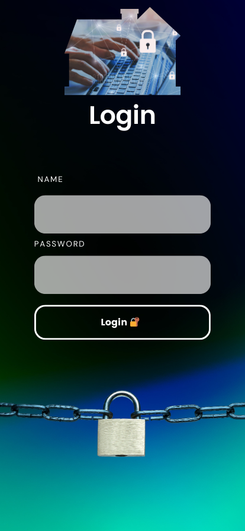
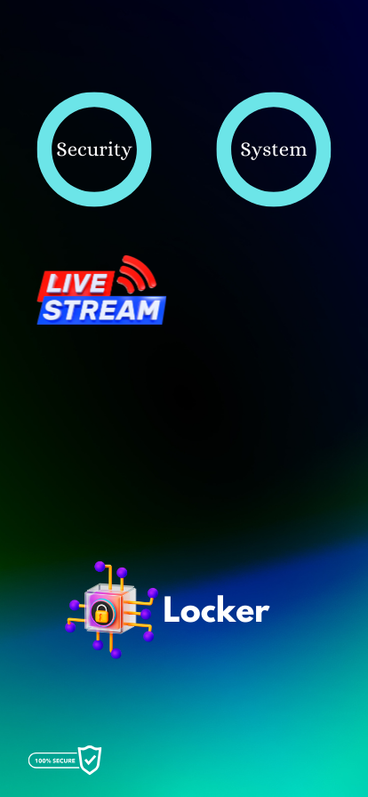

<p align="center">
  
</p>

# HomeSecurityApp

An Android mobile application designed to enhance **home safety and monitoring** by providing real-time security features in a user-friendly interface.  

Built with **Android Studio** and **Gradle**, this app integrates modern Android development practices with **AndroidX libraries** for compatibility and scalability.

---

## Table of Contents
- [Overview](#overview)
- [Features](#features)
- [Architecture](#architecture)
- [Screenshots](#screenshots)
- [Installation](#installation)
- [Configuration](#configuration)
- [Usage](#usage)
- [Tech Stack](#tech-stack)
- [Future Improvements](#future-improvements)
- [Contributors](#contributors)
- [License](#license)

---

## Overview

The **HomeSecurityApp** empowers homeowners to monitor and manage their property directly from their smartphone.  

Core functionalities include:
- User-friendly interface for managing devices and alerts.
- Real-time monitoring integration (e.g., IoT sensors, security cameras).
- Configurable alerts and notifications to keep users informed of potential security issues.

---

## Features

- 🔐 **User Authentication**: Secure login and registration with AndroidX support.  
- 🏠 **Device Dashboard**: Centralized screen to view and manage home security devices.  
- 📸 **Camera Integration**: Stream or snapshot camera feeds (if hardware supported).  
- 📡 **Alerts & Notifications**: Receive push notifications when unusual activity is detected.  
- ⚙️ **Admin Controls**: Add/remove devices, configure thresholds, or manage settings.  
- ☁️ **Cloud/Local Support**: Configurable backend (Firebase or local DB, depending on setup).  

---

## Architecture

The app follows **MVVM (Model-View-ViewModel)** principles for maintainability.  

- **UI Layer**: XML layouts with AndroidX views.  
- **Logic Layer**: Java classes for authentication, device management, and alerts.  
- **Data Layer**: Firebase Realtime Database / Firestore or SQLite (configurable).  
- **Build System**: Gradle with AndroidX support (`android.useAndroidX=true`).  

---

## Screenshots

<p align="center">
  
  
</p>


---

## Installation

### Prerequisites
- **Android Studio (latest version)**  
- **Android SDK** installed (see `local.properties`)  
- JDK 8+  

### Steps
1. Clone the repository:
   ```bash
   git clone https://github.com/SalahElshafey/HomeSecurityApp.git
   cd HomeSecurityApp
   ```
2. Open the project in **Android Studio**.
3. Sync Gradle (`gradlew` is included for Linux/Mac; `gradlew.bat` for Windows).
4. Build and run the app on an emulator or a physical device.

---

## Configuration

### SDK Path
The `local.properties` file should point to your local Android SDK:
```properties
sdk.dir=/path/to/Android/Sdk
```

### Firebase (Optional)
If using Firebase for authentication/alerts:
1. Create a Firebase project.
2. Download `google-services.json` and place it in `app/`.
3. Enable **Email/Password Authentication** (or Google sign-in).
4. Configure Firestore/Realtime Database rules.

---

## Usage

1. Launch the app on your device.  
2. Sign up for a new account or log in.  
3. Add your security devices (sensors, cameras, etc.).  
4. Monitor activity from the dashboard.  
5. Receive alerts/notifications for detected anomalies.  

---

## Tech Stack

- **Language**: Java  
- **Framework**: Android SDK, AndroidX  
- **Database**: Firebase Firestore   
- **Build System**: Gradle  
- **IDE**: Android Studio  

---

## Future Improvements

- AI-based anomaly detection.  
- Multi-device synchronization.  
- Integration with smart locks and IoT hubs.  
  

---

## Contributors

- **Salah Elshafey** 
- **Mohamed Sherif** 

---

## License

This project is licensed under the [MIT License](LICENSE).
